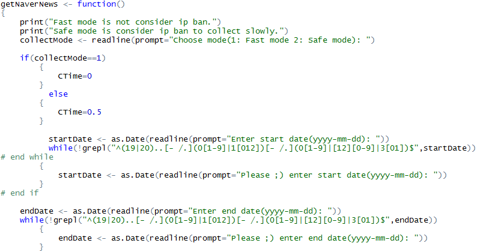
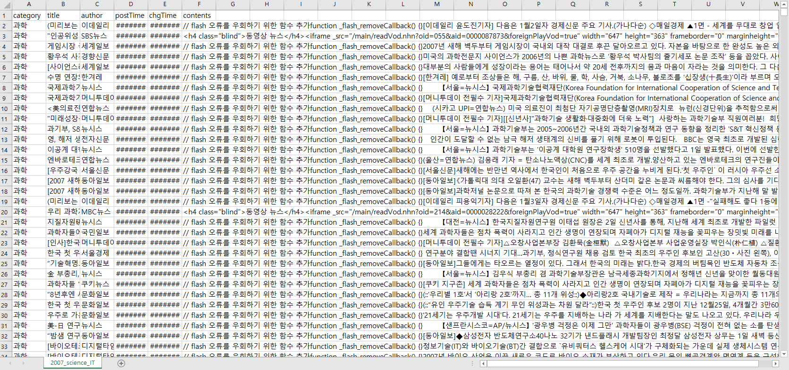

<style>

ol.title {
  list-style-type: upper-roman;
  list-style-position: outside;
  font-size: 20px;
  margin-top: 5px;
  margin-bottom: 5px;
}

ol.contents {
  list-style-position: outside;
  font-size: 20px;
  color: #1F4E79;
}

ol.list {
  list-style-type: upper-alpha;
  list-style-position: outside;
  font-size: 15px;
  color: #1F4E79;
}

ol li {
  margin-left: 0px;
}

div.contents {
  border: 1px solid #BDD7EE;
  border-radius: 5px;
  padding: 10px;
  font-size: 12px;
  color: #000000;
  margin-top: 10px;
  margin-bottom: 10px; 
}

div.explain {
  border: 1px solid #EAECEE;
  border-radius: 5px;
  padding: 10px;
  font-size: 12px;
  color: #CD6155;
  margin-top: 10px;
  margin-bottom: 10px; 
}

p.comment {
  font-size: 15px;
  color: #000000;
}

</style>

```{r setup, include=FALSE}
knitr::opts_chunk$set(message = FALSE)
knitr::opts_chunk$set(warning = FALSE)
knitr::opts_chunk$set(tidy = TRUE)
knitr::opts_chunk$set(comment = '')
knitr::opts_chunk$set(out.width = '900px')
```

```{r include=FALSE}
options(width=800)
```


<br> <br> <hr> <br> <br>

 <br> <br>

<ol class="title">
  <li> <a href="#CH1"> ������ ���� </a> </li>
  <li> <a href="#CH2"> ������ Ž�� </a> </li>
  <li> <a href="#CH3"> �ܾ� ���� </a> </li>
  <li> <a href="#CH4"> Wordcloud </a> </li>
  <li> <a href="#CH5"> Association Rules </a> </li>
  <li> <a href="#CH6"> ��ġ��... </a> </li>
</ol>

<br> <br> <hr> <br> <br>

<!-- -------------------------------- 1. ������ ���� -------------------------------- -->

 <br> <br>

 <br> <br>

<div class="contents">
R�� �̿��Ͽ� ���̹� ���� �����͸� csv ���Ϸ� �����Խ��ϴ�. 
2008����� 2017����� 10���� �����͸� �����ϰ� �;�����, ���а� IT ī�װ����� 1��ġ �����͸� �����ϴ� �� 3�� ������ �ð��� �Ҹ�Ǿ� �ƽ��Ե� 2017��, 2012��, 2007�� �� 3��ġ�� �����͸� �����߽��ϴ�.
</div> <br>

<div style="text-align:right;"><a href="#list"></a></div> <br>

<br> <br> <hr> <br> <br>

<!-- -------------------------------- 2. ������ Ž�� -------------------------------- -->

 <br> <br>

<ol class="contents">

<li> ������ ���� Ȯ�� </li>

<div class="contents">
�����͸� ���� ��, csv ���Ϸ� ����� �����͸� Ž���ϴ� ������ �������ϴ�.
�������� ������ �����, ��� ������ �ִ���, �����Ͱ� ��� �ԷµǾ����� ���� ���캸�ҽ��ϴ�.
</div>

 <br> <br>

<li> ���� Ȯ�� </li>

<div class="contents">
������ Ž�������� ������ ���� ������ ���� `ggplot`�� �̿��Ͽ� ����׷����� �׷����ҽ��ϴ�.
</div> <br>

<p class="comment"> 2017�� </p>
 <br>

<div class="contents">
2017���� �� ������ 83780���̿�����, 11���� 8133������ ���� ���ҽ��ϴ�. �� ��� ������ �� 6982���Դϴ�.
</div> <br>

<p class="comment"> 2012�� </p>
 <br>

<div class="contents">
2012���� �� ������ 85063���̿�����, 6���� 5759������ ���� �������ϴ�. �� ��� ������ �� 7089���Դϴ�.
</div> <br>

<p class="comment"> 2007�� </p>
 <br>

<div class="contents">
2007���� �� ������ 50453�������� ��������� 2017��� 2012���� �������� �ſ� �������ϴ�. �׸��� 4���� 5���� ���� 5173, 5661������ 2007�� �ٸ� ���� ���� ������ ���� ���̾����ϴ�. �� ��� ������ �� 4204���Դϴ�.
</div> <br>

<li> ������ �����ϱ� </li>

<div class="contents">
������ ���� ���캻 ��, �뷮�� ū �����͸� �б⺰�� ���������ϴ�. �׸��� �ܾ �����ϱ� ���� �Ź����, ��������, Ư������ ��� ���� ���ڳ� ������ ����ǥ������ �̿��Ͽ� �����Ͽ����ϴ�.
</div> <br>

</ol>

<div style="text-align:right;"><a href="#list"></a></div> <br>

<br> <br> <hr> <br> <br>

<!-- -------------------------------- 3. �ܾ� ���� -------------------------------- -->

 <br> <br>

<ol class="contents">

<li> ���̺귯�� �ҷ����� </li>

<div class="explain">
KoNLP : �ѱ� �ؽ�Ʈ ���̴��� ���� ��Ű�� <br> <br>
stringr , dplyr : �����ϰ� ������ �ڵ鸵�ϱ� ���� ��Ű��
</div>

```{r eval=FALSE}
library(KoNLP)
library(stringr)
library(dplyr)
```
<br>
<li style="margin-bottom: 10px;"> �ѱ� ���� ��� </li>
```{r eval=FALSE}
# useSystemDic()
# useSejongDic()
useNIADic()
```
<br>
<li> ������ �ҷ����� </li>
<br> <br>
<li> �ܾ� ���� �м� </li>

<div class="explain">
extractNoun : �ܾ� ���� <br> <br>
SimplePos22 : �ܾ� ���� �м�
</div>

```{r eval=FALSE}
# �ܾ� ���� �м�
words <- sapply(Contents, SimplePos22, USE.NAMES = F)


# NC, F ���¸� ���� 
words_pre <- unlist(words)
words_pre <- str_match(words_pre, "([0-9a-zA-Z��-�R]+)/(NC|F)")


# NC, F ���� ���� ����
words_NC <- Filter(function(x) {!is.na(x)}, words_pre[,2])
```

<div class="contents">
ó������ ���� ������ �Ͽ��µ�, ���簡 �ʹ� �и��Ǿ� ����Ǿ� Ű���带 Ȯ���� �� �������ϴ�. �������, '����Ʈ��'�̶�� �ܾ '����Ʈ'�� '��'���� �и��Ǵ� ��찡 ���ҽ��ϴ�. �ѱ� ������ �ܾ �߰��Ͽ��� ������ �ذ��� ���� �ʾ�, �ܾ ���� �м� �� ����� �ܷ�� �����ϴ� �������� �ܾ �����Ͽ����ϴ�.
</div> <br>

<li> ������ ��ó�� </li>

<div class="contents">
������ ������ �ܾ ��ó���ϱ� ���� ���� ���� �ҹ��ڸ� �빮�ڷ� ��� �����Ͽ����ϴ�. �׸��� ���� �ǹ��� �ܾ�� ���� �ܾ�� ��� ���� �����־����ϴ�. �������� �󵵼��� ���� �ܾ���� ��� Ȯ���ϸ� �ʿ���� �ܾ���� �ҿ�� ����Ʈ�� �߰��ϸ� �ҿ�� ����Ʈ�� ��������ϴ�. �ҿ�� ����Ʈ�� �ϼ��� ��, �ҿ�� ����Ʈ�� �ִ� �ܾ �����Ͽ����ϴ�. <br>
�̺κп��� ���� ���� �ð��� �Ҹ��ϰԵǾ����ϴ�. �ҿ�� ����Ʈ�� ����� ������ �ټ� �ְ����̴ٺ��� ������ ������ ���� �ϰԵǾ��� �κ��̾���, �������� �뷮�� �DZ⶧���� �����ϴµ��� �ð��� ������ �����ɷȽ��ϴ�.
</div> <br>

<ol class="list">
<li style="margin-bottom: 10px;"> �ҹ��ڸ� �빮�ڷ� ���� </li>
```{r eval=FALSE}
words_NC <- toupper(words_NC)
```
<br>
<li style="margin-bottom: 10px;"> ���� �ǹ��� �ܾ�� ���� �ܾ�� ���� </li>
```{r eval=FALSE}
words_NC <- toupper(words_NC)
words_NC <- gsub("��S","������S", words_NC)
words_NC <- gsub("(������S[0-9]).*","\\1", words_NC)
words_NC <- gsub("^(S[0-9]).*","������\\1", words_NC)
words_NC <- gsub("����Ʈ", "�����ó�Ʈ", words_NC)
words_NC <- gsub("(�����ó�Ʈ[0-9]).*","\\1", words_NC)
words_NC <- gsub("^(��Ʈ[0-9]).*","������\\1", words_NC)
words_NC <- gsub("(G[0-9]{1,2}).", "\\1", words_NC)
words_NC <- gsub("(V[0-9]{1,2}).", "\\1", words_NC)
words_NC <- gsub("(������[0-9]).", "\\1", words_NC)
words_NC <- gsub("����Ͽ�����׷���", "MWC", words_NC)
words_NC <- gsub("����", "NASA", words_NC)
words_NC <- gsub("������", "DNA", words_NC)
words_NC <- gsub("�޴���ȭ", "�޴���", words_NC)
words_NC <- gsub("������ű��", "ICT", words_NC)
words_NC <- gsub("DRONE", "���", words_NC)
words_NC <- gsub("���ҿ������", "LTE", words_NC)
words_NC <- gsub("��Ƽ��", "LTE", words_NC)
words_NC <- gsub("�����ͺ��̽�", "DB", words_NC)
words_NC <- gsub("4���������.", "4���������", words_NC)
words_NC <- gsub("����.", "����", words_NC)
words_NC <- gsub("�߻簡", "�߻�", words_NC)
words_NC <- gsub("MP3�÷��̾�", "MP3", words_NC)
words_NC <- gsub("������DMB", "DMB", words_NC)
words_NC <- gsub("���ڽŹ����ͳ�", "���ڽŹ�", words_NC)
words_NC <- gsub("�繰���ͳ�", "IOT", words_NC)
words_NC <- gsub("��������", "VR", words_NC)
words_NC <- gsub("��������", "AR", words_NC)
```
<br>
<li style="margin-bottom: 10px;"> �ҿ�� ����Ʈ ����� </li>
```{r eval=FALSE}
words_freq <- table(words_NC)
words_freq <- sort(words_freq, decreasing=T)
words_freq <- words_freq[words_freq >= 300]
words_list <- names(words_freq)
words_list
l <- length(words_list)

for(i in 1:l){
  word <- words_list[i]
  cat(i, ".", word, ": ")
  
  choose_mode <- readline(prompt="(1:remove 2:next *:break) :")
  
  if(choose_mode==1){
    choose_mode2 <- readline(prompt="(1:only *:every) : ")
    
    if(choose_mode2 == 1) {
      word <- paste("^", word,"$", sep="")
    }
    
    count <- length(remove_list) + 1
    remove_list[count] <- word
  }
  else if(choose_mode==2) next
  else break
}
```
<br>
<li style="margin-bottom: 10px;"> �ҿ�� ���� </li>
```{r eval=FALSE}
remove_list <- sort(remove_list, decreasing=T)
r <- length(remove_list)

for(i in 1:r){
  word <- remove_list[i]
  
  words_NC <- gsub(word,"", words_NC)
  words_NC <- Filter(function(x) {nchar(x) >= 1}, words_NC)
  cat(i,".",word,"remove.\n")
}

remove_list <- sort(names(table(remove_list)), decreasing=T)
```
<br>

</ol>

<li style="margin-bottom: 10px;"> �ܾ� �󵵼� Ȯ�� </li>
```{r eval=FALSE}
words_freq <- table(words_NC)
words_freq <- sort(words_freq, decreasing=T)
words_freq <- words_freq[words_freq >= 300]
words_freq
```

<div class="contents">
2017��� 2012�� �������� �ܾ�� �󵵼��� 300�� �̻��� �ܾ�鸸 �����ϰ�, 2007�� �������� �ܾ�� �󵵼��� 200�� �̻��� �ܾ�鸸 �����Ͽ����ϴ�.
</div> <br>

<li> ������ �⵵���� ��ġ�� </li>

<div class="contents">
�б⺰�� �������� �ִ� ��ó���� �����͵��� �⵵���� �����͸� �����־����ϴ�.
<div> <br>

</ol>

<div style="text-align:right;"><a href="#list"></a></div> <br>

<br> <br> <hr> <br> <br>

<!-- -------------------------------- 4. Wordcloud -------------------------------- -->

 <br> <br>

<div class="contents">
�������� `wordcloud2` ��Ű���� �̿��Ͽ� �⵵���� Wordcloud �ð�ȭ�� �غ��ҽ��ϴ�. Wordcloud ���� ���콺 Ŀ���� �ø��ø� �ش� Ű������ �󵵼��� Ȯ���Ͻ� �� �ֽ��ϴ�.
</div>

```{r}
library(wordcloud2)
```

```{r echo=FALSE}
c <- c('#E6B0AA','#F5B7B1','#D7BDE2',
       '#D2B4DE','#A9CCE3','#AED6F1',
       '#A3E4D7','#A2D9CE','#A9DFBF',
       '#ABEBC6','#F9E79F','#FAD7A0',
       '#F5CBA7','#EDBB99','#F2D7D5',
       '#FADBD8','#E8DAEF','#D4E6F1',
       '#D6EAF8','#D1F2EB','#D0ECE7',
       '#D4EFDF','#D5F5E3','#FAE5D3',
       '#F6DDCC','#D7DBDD','#BFC9CA',
       '#CCD1D1','#B3B6B7','#A6ACAF')
c <- rep(c, times=8)
```
<br> <br>
<p class="comment"> 2017 Title </p>
```{r fig.align='center'}
freq <- read.table("science_IT_data/2017/2017_title_freq.txt", header=T)
wordcloud2(freq, color=c)
```
<br>
<p class="comment"> 2017 Contents </p>
```{r fig.align='center'}
freq <- read.table("science_IT_data/2017/2017_contents_freq.txt", header=T)
wordcloud2(freq, color=c)
```
<br>

<div class="contents">
2017���� '����Ʈ��', '�ΰ�����', 'IOT', 'ICT', '�κ�', 'VR', '5G', 'AR' ��� ���� ���� ���� ������ ���� �о߿� ���� ������� Ű����� ���� �������ϴ�. �׸��� '�����ó�Ʈ','������' ��� ���� ����Ʈ�� ������ ���� Ű���嵵 ���� ��޵ǰ� �ִ� ���� Ȯ���Ͻ� �� �ֽ��ϴ�. �̿ܿ��� '����', '����', '����', '����', '����' ��� ���� ����, IT�迭���� ���� ���̴� �ܾ Ű����� ���� �������� �ֽ��ϴ�. <br>
'�ΰ�����'�� 'AI'�� ���� ��������, 'AI'�� '��������'�� �浵 ���ԵǾ� �־� ���� �ܾ�� �������� ���߽��ϴ�. <br>
</div> <br> <br>

<p class="comment"> 2012 Title </p>
```{r fig.align='center'}
freq <- read.table("science_IT_data/2012/2012_title_freq.txt", header=T)
wordcloud2(freq, color=c)
```
<br>
<p class="comment"> 2012 Contents </p>
```{r fig.align='center'}
freq <- read.table("science_IT_data/2012/2012_contents_freq.txt", header=T)
wordcloud2(freq, color=c)
```
<br>

<div class="contents">
2012���� 'LTE', '����Ʈ��', 'Ŭ����', '����ȣ', 'īī����', '����ƮTV' ��� ���� Ű���尡 ���� �������, '������', '������', '��Ƽ�ӽ�' ��� ���� ����Ʈ�� ������ ���� Ű���嵵 ���캸�� �� �ֽ��ϴ�. Ư��, 'LTE'�� '����Ʈ��'�� �ٸ� �ܾ�鿡 ���� �ſ� ũ�� �׷��� ���� Ȯ���Ͻ� �� �ֽ��ϴ�. <br>
2017�⿡ ���� ��޵Ǿ��� 'ICT'�� 2012�⿡�� ���׸İ� �������� ���� Ȯ���Ͻ� �� �ֽ��ϴ�. �׸��� '�ΰ�����', 'IOT' ��� ���� Ű����� ã�� �� �� �������ϴ�.
</div> <br> <br>

<p class="comment"> 2007 Title </p>
```{r fig.align='center'}
freq <- read.table("science_IT_data/2007/2007_title_freq.txt", header=T)
wordcloud2(freq, color=c)
```
<br>
<p class="comment"> 2007 Contents </p>
```{r fig.align='center'}
freq <- read.table("science_IT_data/2007/2007_contents_freq.txt", header=T)
wordcloud2(freq, color=c)
```
<br>

<div class="contents">
2007�⿡�� '����Ʈ��'�� ���� Ű���带 ã�� �� �� ��������, '�޴���', LCD', '���ͳ�', 'IPTV', 'UCC' ��� ���� Ű���尡 ���� ���� ������ϴ�. �׸��� 2012��, 2017�⿡�� IT ���� �� ���� ���� ������µ�, 2007�⿡�� '������', '�ٱ⼼��', 'DNA' ��� ���� ���а��� �� ��¦ Ű����� �������ϴ�.
</div> <br>

<div style="text-align:right;"><a href="#list"></a></div> <br>

<br> <br> <hr> <br> <br>

<!-- -------------------------------- 5. Association Rules -------------------------------- -->

 <br> <br>

<div class="explain">
arules : �����м��� �ϱ� ���� ��Ű�� <br> <br>
arulesViz, visNetwork, igraph : �����м�, ��Ʈ��ũ�м� �ð�ȭ�� ���� ��Ű��
</div>

```{r}
library(arules)
library(arulesViz)
library(visNetwork)
library(igraph)
```

```{r eval=FALSE}
# �������� ��ȯ
words_tran <- as(words_NC, "transactions")


# ������Ģ �м�
words_net <- apriori(words_tran, 
                     parameter=list(support=0.01, confidence=0.20, minlen=2))
```

<div class="contents">
��ó���� �� �ܾ���� ������Ģ �м��� �ϱ� ���� ���·� `as`�� �̿��Ͽ� ��ȯ���ְ�, `apriori`�� �̿��Ͽ� ������Ģ �м��� ������ 0.01�̻�, �ŷڵ� 0.20�̻����� �����Ͽ� �ǽ��Ͽ����ϴ�. 2007����� ���ʴ�� ���캸���� �ϰڽ��ϴ�. 
</div> <br>

<p class="comment"> 2007�� �����м� </p>
```{r}
load("science_IT_data/2007/2007_net.RData")
inspect(net2007)
```

<div class="contents">
2007���� �� 40���� ��Ģ�� ã������, ��κ� '����'�̶�� �ܾ ���� ��޵ǰ� ������ Ȯ���Ͻ� �� �ֽ��ϴ�. �������� ���� ���� ���� 0.035�� '����'�� '����' �ܾ ���� ���Ǿ��� �� �����ϴ�. �ŷڵ��� ���� ���� ���� 0.625�� 'DNA'�� ��޵Ǿ��� �� '����'�� ��޵� ��쿴���ϴ�. ��󵵰� ���� ���� ���� 8.214�� '���÷���'�� ��޵��� �ʾ��� ������ ��޵Ǿ��� ��  'LCD'�� ��޵Ǵ� ���������� ���� ���ҽ��ϴ�. <br>
��ü������ '�޴���', '�ݵ�ü', '����', 'LCD'�� ��޵Ǿ��� �� '����'�� ���� ��޵ǰ� ������, 'LCD', 'ī�޶�', 'MP3', 3G'�� ��޵Ǿ��� �� '�޴���'�� ���� ��޵ǰ� �־����ϴ�. wordcloud �߾� Ű���忡 �ִ� '����'�� '�޴���'�� ������ ��忡 ���� �ִ� �͵� Ȯ���Ͻ� �� �ֽ��ϴ�.
</div> <br>

```{r}
plot(net2007)
```
<br>

<div class="contents">
�� �׷����� ��Ģ���� ��������, �ŷڵ�, ��󵵰� ��� �����Ǿ� �ִ��� Ȯ���Ͻ� �� �ִ� �׷����Դϴ�. 2007�� 40���� ��Ģ�� ������ 0.01�� 0.02 ���̿� ��κ� �־����ϴ�.
</div> <br>

```{r fig.height=7}
plot(net2007, method="grouped")
```

```{r fig.show='hide', results='hide'}
ig <- plot(net2007, method="graph", control=list(type="items",max=500))
```

```{r}
ig_df <- get.data.frame(ig, what="both")

visNetwork(
  nodes = data.frame(
    id = ig_df$vertices$name,
    value = ig_df$vertices$support,
    title = ifelse(ig_df$vertices$label == "",
                   ig_df$vertices$name, 
                   ig_df$vertices$label),
    ig_df$vertices
  ), 
  edges = ig_df$edges
) %>%
  visEdges(ig_df$edges) %>%
  visOptions(highlightNearest = T)
```

<div class="explain">
&hearts; �׷����ʿ� ���콺 Ŀ���� ��� ���콺 ���� �̿��Ͻø� Ȯ���ϼż� ���� �� �ֽ��ϴ�. <br>
&hearts; ��带 Ŭ���Ͻø� �����Ǿ� �ִ� �ܾ���� �� �������ϴ�. <br>
&hearts; ��带 �����̽ø� �����Ǿ� �ִ� �ܾ�鵵 ���� �����Դϴ�.
</div>

<div class="contents">
�� �׷����� 40���� ��Ģ�� �ð�ȭ�� ���Դϴ�. '����'�� �߽����� ���� �ܾ� ���� ��޵Ǿ� �ִ� ���� Ȯ���Ͻ� �� �ֽ��ϴ�. '�޴���'�� �߽����ε� ���� ���� �ܾ���� ��޵Ǿ� �ִ� ���� Ȯ���Ͻ� �� �ֽ��ϴ�. <br>
wordcloud���� �߾ӿ� �ִ� Ű������� �����м������� �߾� �ʿ� ��ġ�Ͽ� ���� �ܾ��� ������ �Ǿ� ������ Ȯ���Ͻ� �� �ֽ��ϴ�.
</div> <br> <br>

<p class="comment"> 2012�� �����м� </p>
```{r}
load("science_IT_data/2012/2012_net.RData")
inspect(net2012)
```

<div class="contents">
2012���� �� 170���� ��Ģ�� ã������, wordcloud���� Ű���忴�� '����Ʈ��'�� 'LTE'�� ������ ��忡 ���ҽ��ϴ�. �̴� �ٸ� �ܾ��� ������ ���ٴ� ���� Ȯ���Ͻ� �� �ֽ��ϴ�.<br>
�������� ���� ���� ���� 0.054�� 'LTE'�� '����Ʈ��'�� ���� ���Ǿ��� �� ������, �ŷڵ��� ���� ���� ���� 0.865�� '��Ƽ�ӽ�'�� ��޵Ǿ��� �� '����Ʈ��'�� ��޵Ǿ��� �� �����ϴ�. ����Ʈ���� ���� �����ϸ鼭 'LTE'�� ����Ʈ�� ������ ���� �������谡 ���������� �����ذ� �Ǿ����ϴ�.<br> 
�׸��� ��󵵰� ���� ���� ���� 14.774�� '��ǻ��'�� ��޵��� �ʾ��� ������ ��޵Ǿ��� �� 'Ŭ����'�� ��޵Ǵ� ���������� 'Ŭ����'�� ��޵��� �ʾ��� ������ ��޵Ǿ��� �� '��ǻ��'�� ��޵Ǵ� ���������� ���� ���ҽ��ϴ�. �̴� 'Ŭ������ǻ��'���� ���� ���Ǿ� �̷��� ����� ���� ������ �����˴ϴ�.<br>
��ü������ ����Ʈ�� ����, 'LTE', '4G', '�÷���', '�º���' ��� '����Ʈ��'�� ���� �������谡 �־����ϴ�. �̸� ���� 2012���� IT�迭�� �������� ����Ʈ���� ����Ʈ���� ���õ� �κе��� ������ �Ǿ����� �����ϰԵǾ����ϴ�.
</div> <br>

```{r}
plot(net2012)
```
<br>

<div class="contents">
�� �׷����� ��Ģ���� ��������, �ŷڵ�, ��󵵰� ��� �����Ǿ� �ִ��� Ȯ���Ͻ� �� �ִ� �׷����Դϴ�.
2012���� 170�� ��Ģ���� ������ 0.01�� 0.02���̿� ���� �����Ǿ� �ִ� ���� Ȯ���Ͻ� �� �ֽ��ϴ�. �׸��� ��󵵰� �ſ� ���� ��Ģ�� 3�� ������ Ȯ���Ͻ� �� �ֽ��ϴ�.
</div> <br>

```{r fig.height=7}
plot(net2012, method="grouped")
```

```{r fig.show='hide', results='hide'}
ig <- plot(net2012, method="graph", control=list(type="items",max=500))
```

```{r}
ig_df <- get.data.frame(ig, what="both")

visNetwork(
  nodes = data.frame(
    id = ig_df$vertices$name,
    value = ig_df$vertices$support,
    title = ifelse(ig_df$vertices$label == "",
                   ig_df$vertices$name, 
                   ig_df$vertices$label),
    ig_df$vertices
  ), 
  edges = ig_df$edges
) %>%
  visEdges(ig_df$edges) %>%
  visOptions(highlightNearest = T)
```

<div class="explain">
&hearts; �׷����ʿ� ���콺 Ŀ���� ��� ���콺 ���� �̿��Ͻø� Ȯ���ϼż� ���� �� �ֽ��ϴ�. <br>
&hearts; ��带 Ŭ���Ͻø� �����Ǿ� �ִ� �ܾ���� �� �������ϴ�. <br>
&hearts; ��带 �����̽ø� �����Ǿ� �ִ� �ܾ�鵵 ���� �����Դϴ�.
</div>

<div class="contents">
�� �׷����� 2012�� 170���� ��Ģ���� �ð�ȭ�� ���Դϴ�. 2007�⺸�� ��Ģ�� ���ұ� ������ �����ϰ� ���谡 �׷�����, '����Ʈ��'�� �߽����� ���� �ܾ���� ���� �Ǿ� �ִ� ���� Ȯ���Ͻ� �� �ֽ��ϴ�. '����Ʈ��' �̿ܿ��� 'LTE', '�÷���', '����'�� �߽����� �����Ǿ� �ִ� �ܾ�鵵 ���ҽ��ϴ�.<br>
2012�⵵ wordcloud ���� �߾ӿ� �ִ� Ű������� ���� �ܾ��� ������ �Ǿ� �ִ� ���� Ȯ���� �� �ֽ��ϴ�.
</div> <br> <br>

<p class="comment"> 2017�� �����м� </p>
```{r}
load("science_IT_data/2017/2017_net2.RData")
inspect(net2017)
```

<div class="contents">
2017���� �� 352���� ��Ģ�� ã�ҽ��ϴ�. 2007��� 2012�⺸�� �ξ����� ��Ģ���� �־�����, �ܾ�鵵 ������ �پ��߽��ϴ�.<br>
������ ����ߵ��� 'AI'�� '�ΰ�����'�� ��� '��������'�� ���� �־� wordcloud������ ���Ͻ�Ű�� ��������, �����м��� �� ���� 'AI'�� '�ΰ�����'���� ���Ͻ��׽��ϴ�.<br>
�������� ���� ���� ���� 0.053���� '����'�� '����'�� ���� ���Ǿ��� �� �����ϴ�. �ŷڵ��� ���� ���� ���� 0.915�� 'MMORPG'�� ��޵Ǿ��� �� '����'�� ��޵� ��� �����ϴ�. 'MMORPG'�� �¶��� �����̱� ������ '����'�� ���� ��޵� ������ �����˴ϴ�.<br>
��󵵰� ���� ���� ���� 23.571�� 'LCD'�� ��޵��� �ʾ��� ������ ��޵Ǿ��� �� 'OLED'�� ��޵Ǵ� ���������� 'OLED'�� ��޵��� �ʾ��� �� ���� ��޵Ǿ��� �� 'LCD'�� ��޵Ǵ� ���������� ���� ���ҽ��ϴ�.<br>
��ü������ ������ ��忡 '�ΰ�����', '����Ʈ��', 'IOT', '������' ��� ���� �ܾ���� ���� ��޵Ǿ� �ֽ��ϴ�.
</div> <br>

```{r}
plot(net2017)
```

<div class="contents">
�� �׷����� ��Ģ���� ��������, �ŷڵ�, ��󵵰� ��� �����Ǿ� �ִ��� Ȯ���Ͻ� �� �ִ� �׷����Դϴ�.
2017���� 352�� ��Ģ���� ������ 0.01���� 0.02 ���̿� �ſ� ���� �����Ǿ� �ֽ��ϴ�. �׸��� �ŷڵ� 0.2���� 0.5���̿� ���� �����Ǿ� �ֽ��ϴ�.
</div> <br>

```{r fig.height=7}
plot(net2017, method="grouped")
```

```{r fig.show='hide', results='hide'}
ig <- plot(net2017, method="graph", control=list(type="items",max=500))
```

```{r}
ig_df <- get.data.frame(ig, what="both")

visNetwork(
  nodes = data.frame(
    id = ig_df$vertices$name,
    value = ig_df$vertices$support,
    title = ifelse(ig_df$vertices$label == "",
                   ig_df$vertices$name, 
                   ig_df$vertices$label),
    ig_df$vertices
  ), 
  edges = ig_df$edges
) %>%
  visEdges(ig_df$edges) %>%
  visOptions(highlightNearest = T)
```

<div class="explain">
&hearts; �׷����ʿ� ���콺 Ŀ���� ��� ���콺 ���� �̿��Ͻø� Ȯ���ϼż� ���� �� �ֽ��ϴ�. <br>
&hearts; ��带 Ŭ���Ͻø� �����Ǿ� �ִ� �ܾ���� �� �������ϴ�. <br>
&hearts; ��带 �����̽ø� �����Ǿ� �ִ� �ܾ�鵵 ���� �����Դϴ�.
</div>

<div class="contents">
�� �׷����� 2017�� 352���� ��Ģ���� �ð�ȭ�� ���Դϴ�. ���赵�� 2007��� 2012�⵵���� �ſ� �����ϰ� �׷��� ���� Ȯ���Ͻ� �� �ֽ��ϴ�.<br>
'�ΰ�����', 'IOT', '�÷���', '����', '������', '����Ʈ��' �� ���� �ܾ�� �ֺ����� ���� �ܾ���� �����Ǿ� �ֽ��ϴ�.<br>
wordcloud���� ���� ���̴� Ű���尡 �����м������� ���� �ܾ��� ���� ����Ǿ� �־����ϴ�. Ư�� '�ΰ�����', 'IOT'�� ���� �ܾ�� 2012�⿡�� ������ �ʴ� Ű���忴���ϴ�. 2017�⿡�� '�ΰ�����'�� 'IOT' ���߿� ������ �������� Ȯ���Ͻ� �� �ֽ��ϴ�.
</div> <br> <br>

<div style="text-align:right;"><a href="#list"></a></div> <br>

<br> <br> <hr> <br> <br>

<!-- -------------------------------- 6. ��ġ��... -------------------------------- -->

 <br> <br>

<div class="contents">
���̹� ������ �ؽ�Ʈ ���̴� �����м��� �ϸ鼭 ���� ������ ��� �Ǿ����ϴ�. �׷��� �� ������Ʈ ��ģ ��, Python���� 2017�� '�ΰ�����', 'IOT', '����Ʈ��'�� ���õ� ��縸 ���� �����м��� �����м� ���� �����ϰ��� ��ȹ �� �Դϴ�. �����մϴ�.
</div> <br> <br>